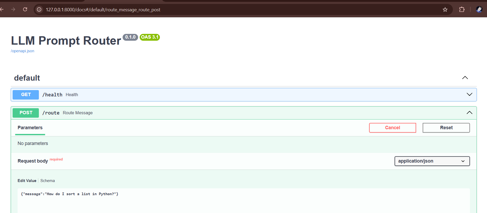

# LLM-Powered Prompt Router for Intent Classification

## Overview

This project implements an **LLM-powered prompt routing system** that classifies user intent and routes requests to specialized AI personas. Instead of using a single large prompt, the system follows a **two-step architecture**:

1. **Intent Classification** – A lightweight LLM call determines the user's intent.
2. **Expert Response Generation** – The system routes the request to a specialized persona prompt that produces the final response.

This approach improves **accuracy, modularity, and cost efficiency** compared to monolithic prompt designs.

---
# LLM Prompt Router


---

## API Documentation

FastAPI automatically generates OpenAPI documentation.



---

## Architecture

```
User Request
      │
      ▼
Intent Classifier (LLM)
      │
      ▼
Intent Router
      │
      ├── Code Expert
      ├── Data Analyst
      ├── Writing Coach
      └── Career Advisor
      │
      ▼
Response Generator (LLM)
      │
      ▼
JSONL Logging
```

---

## Features

* **Intent-based prompt routing**
* **Four specialized expert personas**
* **Structured JSON classifier output**
* **Graceful fallback for malformed responses**
* **JSONL request logging**
* **FastAPI API service**
* **Unit and integration testing**
* **Docker containerization**
* **Environment-based configuration**

---

## Expert Personas

The router currently supports the following expert assistants:

| Intent    | Persona               | Description                                       |
| --------- | --------------------- | ------------------------------------------------- |
| `code`    | Code Expert           | Provides production-quality programming solutions |
| `data`    | Data Analyst          | Interprets datasets and statistical patterns      |
| `writing` | Writing Coach         | Improves clarity, structure, and tone of writing  |
| `career`  | Career Advisor        | Gives actionable career guidance                  |
| `unclear` | Clarification Handler | Requests clarification when intent is ambiguous   |

---

## Project Structure

```
llm-prompt-router/
│
├── src/
│   ├── app.py
│   ├── classifier.py
│   ├── router.py
│   ├── prompts.py
│   ├── api_client.py
│   ├── logging.py
│   └── config.py
│
├── tests/
│   ├── test_api_client.py
│   ├── test_classifier.py
│   ├── test_router.py
│   ├── test_logging.py
│   ├── test_app.py
│   └── test_integration.py
│
├── route_log.jsonl
├── requirements.txt
├── Dockerfile
├── docker-compose.yml
├── .env.example
├── .gitignore
└── README.md
```

---

## Installation

### 1. Clone Repository

```bash
git clone https://github.com/rakeshchinni77/llm-prompt-router
cd llm-prompt-router
```

### 2. Create Virtual Environment

```bash
python -m venv venv
```

Activate environment:

**Windows**

```bash
venv\Scripts\activate
```

**Mac/Linux**

```bash
source venv/bin/activate
```

### 3. Install Dependencies

```bash
pip install -r requirements.txt
```

---

## Environment Configuration

Create a `.env` file based on `.env.example`.

Example:

```
APP_NAME=LLM Prompt Router
APP_ENV=development
APP_HOST=127.0.0.1
APP_PORT=8000
APP_DEBUG=true

LLM_PROVIDER=groq

GROQ_API_KEY=your_groq_api_key_here

GROQ_MODEL_CLASSIFIER=llama-3.1-8b-instant
GROQ_MODEL_GENERATION=llama-3.3-70b-versatile

APP_CONFIDENCE_THRESHOLD=0.70

LOG_FILE=route_log.jsonl
```

### Getting a Groq API Key

1. Visit https://console.groq.com/
2. Create an account
3. Generate an API key
4. Add the key to `.env`

---

## Running the Application

Start the FastAPI server:

```bash
uvicorn src.app:app --reload
```

Server runs at:

```
http://localhost:8000
```

---

## API Endpoints

### Health Check

```
GET /health
```

Response:

```json
{
 "status": "ok"
}
```

---

### Route Message

```
POST /route
```

Request:

```json
{
 "message": "How do I sort a list in Python?"
}
```

Response:

```json
{
 "intent": "code",
 "confidence": 0.92,
 "final_response": "Use the sorted() function in Python..."
}
```

---

## Logging

Every request is logged to:

```
route_log.jsonl
```

Example log entry:

```json
{
 "timestamp": "2026-03-13T10:46:51.128820+00:00",
 "intent": "code",
 "confidence": 0.9,
 "user_message": "How do I sort a list in Python?",
 "final_response": "..."
}
```

The JSONL format allows easy integration with log analysis tools.

---

## Running Tests

Run the full test suite:

```bash
pytest -v
```

Expected result:

```
25 passed
```

Test coverage includes:

* API client
* Intent classifier
* Router logic
* Logging system
* FastAPI endpoints
* Integration test scenarios

---

## Docker Setup

### Build Image

```bash
docker build -t llm-prompt-router .
```

### Run with Docker Compose

```bash
docker compose up --build
```

Server will be available at:

```
http://localhost:8000
```

---

## Example Test Requests

The system was tested with various inputs including:

* "how do i sort a list of objects in python?"
* "explain this sql query for me"
* "This paragraph sounds awkward, can you help me fix it?"
* "I'm preparing for a job interview, any tips?"
* "what's the average of these numbers: 12, 45, 23, 67, 34"
* "Help me make this better."
* "hey"
* "Can you write me a poem about clouds?"
* "Rewrite this sentence to be more professional."
* "I'm not sure what to do with my career."

---

## Design Decisions

### Intent-Based Routing

Separating classification and response generation improves:

* accuracy
* modularity
* scalability

### Expert Personas

Each persona is optimized for a specific domain, producing higher-quality responses.

### Structured LLM Output

Classifier responses are constrained to JSON format:

```json
{
 "intent": "code",
 "confidence": 0.92
}
```

This allows safe parsing and routing.

### Safe Fallback Handling

If classification fails or JSON is malformed, the system safely returns:

```
intent: unclear
confidence: 0.0
```

and asks the user for clarification.

---

## Technologies Used

* Python
* FastAPI
* Groq LLM API
* Pytest
* Docker
* dotenv
* JSON Lines logging

---

## Author

Built as part of an **AI Engineering Backend Task** focusing on prompt routing architecture and LLM integration.

---
